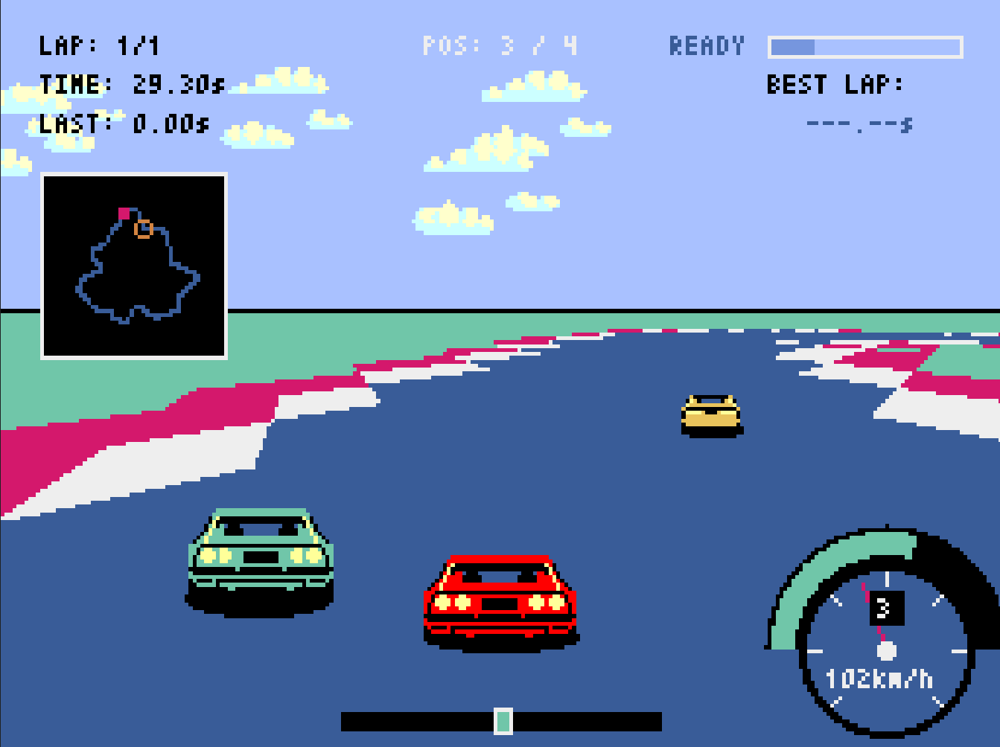
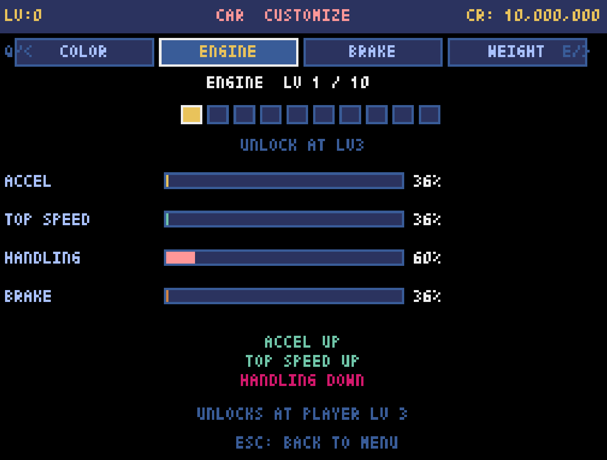
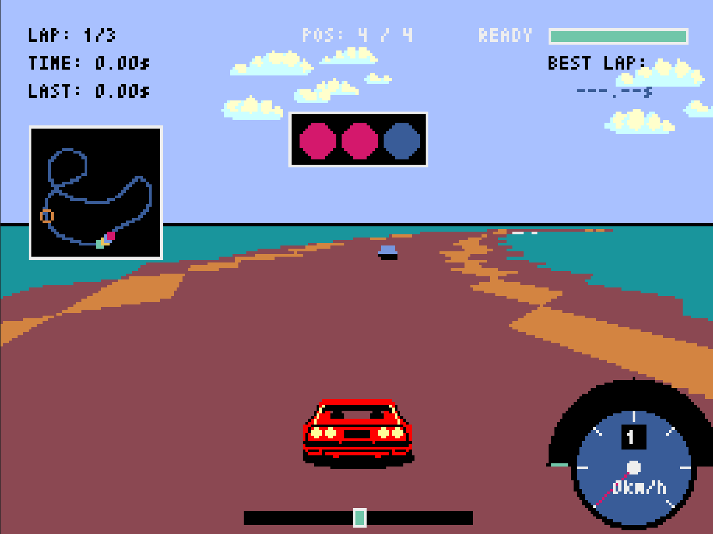
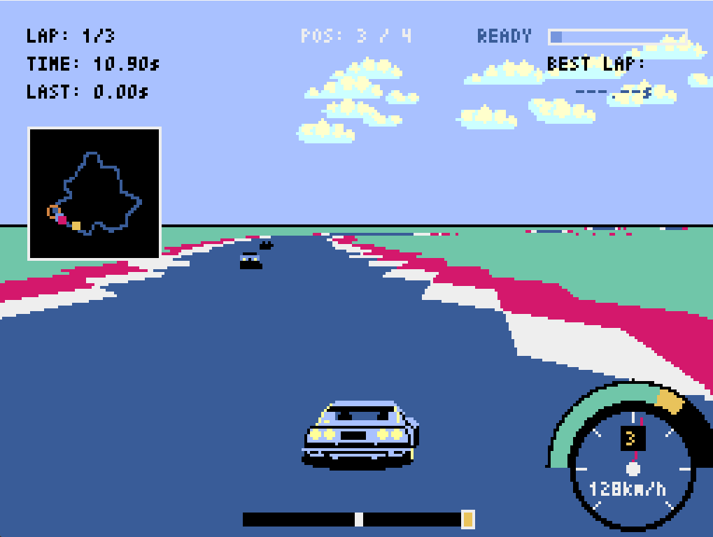

# Highway Racer / ハイウェイレーサー

## How to Run

This is a project created with the help of AI.

### Run from GitHub Actions builds

If you push this project to GitHub with the included workflow, GitHub Actions can build desktop packages for you.

To use the built version:

1. Push the project to GitHub
2. Open the repository on GitHub
3. Open the `Actions` tab
4. Open the latest successful workflow run
5. Download the artifact for your platform
6. Run the downloaded Windows `.exe` or macOS `.app`

#### Run from GitHub Releases

If a release has been published on GitHub, you can also download the packaged files from the `Releases` page.

Steps:

1. Open the repository page on GitHub
2. Open `Releases`
3. Select the version you want
4. Download the attached Windows `.exe` or macOS `.app`
5. Run the downloaded file

### Run from Python source

Please run `main.py` with the required files and folders prepared.

Run:

```bash
python main.py
```

Required files and folders:

- `main.py`
- `subprograms/`
- `assets/car.png`
- `assets/cloud.png`
- `assets/rock.png`
- `assets/title.png`
- `fonts/jp.bdf`

If needed, install the required libraries first:

```bash
pip install pyxel pygame "websockets<14"
```

Please note that the current code does not support the latest version of `websockets`.

The author's environment is as follows. If it does not work well, please check the versions:

- `pyxel 2.6.5`
- `pygame 2.6.1`
- `websockets 13.0`

---

## English

### Overview

`HIGHWAY RACER` is a racing game built with Pyxel. It includes standard races, time attack, grand prix mode, a course maker, and online play.

This project was created with the help of AI.

It is inspired by Square's `HIGHWAY STAR` game. To be honest, the car texture is basically copied from it.

### Features

- Multiple paved and off-road tracks
- Standard race, time attack, and grand prix modes
- Custom course creation with the built-in course maker
- Progression elements such as level, experience, credits, and part upgrades
- Online room play support, which is currently still in development and unstable

### Screenshots

Race screen 1:



Customize:



Race screen 2:



Race screen 3:



### Controls

The basic control method is the keyboard. The game also supports steering-wheel style input, including setups such as the Thrustmaster T300 RS.

#### Menu controls

- `A` / `D` or `Left` / `Right`: Change selection
- `W` / `S` or `Up` / `Down`: Move cursor or adjust values
- `SPACE` / `ENTER`: Confirm
- `ESC`: Back or cancel
- `E`: Move to the course maker from the course select screen when the condition is met (player level 50)
- `Q` / `E`: Switch items on the customize screen

#### In-race controls

- `Left` / `Right` or `A` / `D`: Steering
- `Up` / `Down` or `W` / `S`: Accelerate / brake
- `Q` / `E`: Shift down / shift up
- `SPACE`: Nitro
- `ESC`: Pause

### Implementation Notes

#### 1. Project structure

The game is centered on a single `App` class, while its behavior is split into mixins by responsibility. `main.py` only launches `App()`, and the actual logic is organized under `subprograms`.

The main class is defined in [game_app.py](subprograms/game_app.py). This is where course definitions, shared constants, and mixin composition are managed.

#### 2. Rendering approach

Rendering is built with Pyxel's 2D API while sampling the course map and stretching the ground in front of the player.

- [app_draw_core.py](subprograms/app_draw_core.py)
  uses `draw_mode7_road()` to project a 256x256 course image and represent a pseudo-3D road surface
- The same module also includes `draw_walls_3d()` for simple projected wall rendering


#### 3. Course construction

Tracks are created from control points and then smoothed.

- [app_course.py](subprograms/app_course.py)
  uses Catmull-Rom spline interpolation to create smooth track lines
- Checkpoints, start lines, walls, and road widths are derived from course definitions
- Internal map data for minimaps and course checks is also prepared here

This makes it possible to build natural looped tracks from hand-authored point data.

#### 4. Update flow

Game progression is divided by state.

- [app_update.py](subprograms/app_update.py)
  entry point for update logic
- [app_update_menu.py](subprograms/app_update_menu.py)
  title, menu, options, and screen transitions
- [app_update_race.py](subprograms/app_update_race.py)
  race behavior, rank, laps, collisions, boosts, and finish handling
- [app_update_online.py](subprograms/app_update_online.py)
  online synchronization flow

#### 5. Role of each program

- [main.py](main.py)
  entry point
- [game_app.py](subprograms/game_app.py)
  main application, course definitions, shared constants
- [common.py](subprograms/common.py)
  shared imports, joystick handling, platform flags, external service settings
- [app_runtime.py](subprograms/app_runtime.py)
  startup initialization, asset loading, save-directory management, game state setup
- [app_course.py](subprograms/app_course.py)
  course generation, smoothing, map building, checkpoint logic
- [app_draw.py](subprograms/app_draw.py)
  rendering integration layer
- [app_draw_core.py](subprograms/app_draw_core.py)
  core race rendering, pseudo-3D road, walls, camera effects
- [app_draw_menu.py](subprograms/app_draw_menu.py)
  menu and UI rendering
- [app_draw_online.py](subprograms/app_draw_online.py)
  online-related screens
- [app_update.py](subprograms/app_update.py)
  update integration layer
- [app_update_menu.py](subprograms/app_update_menu.py)
  menu input and transitions
- [app_update_race.py](subprograms/app_update_race.py)
  race logic, boosts, ranking, goal handling
- [app_update_online.py](subprograms/app_update_online.py)
  online state updates
- [app_storage.py](subprograms/app_storage.py)
  best times, ghosts, credits, settings, and car data persistence
- [app_maker.py](subprograms/app_maker.py)
  course maker
- [online.py](subprograms/online.py)
  Supabase Realtime client
- [rival.py](subprograms/rival.py)
  rival AI behavior
- [player_progression.py](subprograms/player_progression.py)
  level and XP progression

#### 6. Rival AI and progression

Rival cars follow the nearest point on the course and adjust speed and handling based on the gap between themselves and the player.

- [rival.py](subprograms/rival.py)
  includes rubber-band balancing, surface checks, and course following
- [player_progression.py](subprograms/player_progression.py)
  handles XP calculation, leveling, and unlock requirements

### 7. Notes

To explain once again, this code was created using AI, so there may be some unreasonable points in the logic or implementation. Also, because the author's environment is Windows, startup of the macOS `.app` is not guaranteed.

---

## 日本語

### 概要
`HIGHWAYRACER` はPyxelというライブラリを利用し作られたレースゲームです。通常レース、タイムアタック、グランプリ、コースメーカー、オンライン対戦などを遊ぶことができます。

この作品は AI を活用して制作したプロジェクトです。

スクウェア社のHIGHWAY　STARというゲームに着想を得ています（というか車のテクスチャはパクリです）。

### 起動方法

#### GitHub Actions から起動する方法

このフォルダに含まれているworkflowを使ってGitHubにpushするとGitHub ActionsのArtifactからexeファイルとappファイルがダウンロードできます。

手順:

1. プロジェクトをGitHubにpushする
2. GitHubのリポジトリページを開く
3. `Actions`タブを開く
4. 最新の成功したworkflowを開く
5. 自分の環境向けartifactをダウンロードする
6. Windows なら`.exe`、macOS なら`.app`を実行する

#### GitHub Releases から起動する方法

GitHubでReleaseが公開されている場合は、`Releases` ページから配布用ファイルをダウンロードして起動することもできます。

手順:

1. GitHubのリポジトリページを開く
2. `Releases` を開く
3. 欲しいバージョンを選ぶ
4. 添付されているWindows用`.exe` または macOS用`.app` をダウンロードする
5. ダウンロードしたファイルを実行する

#### Python から起動する方法

必要なファイルやフォルダをそろえた状態で`main.py`を実行してください。

実行コマンド:

```bash
python main.py
```

必要なファイルとフォルダ:

- `main.py`
- `subprograms/`
- `assets/car.png`
- `assets/cloud.png`
- `assets/rock.png`
- `assets/title.png`
- `fonts/jp.bdf`


必要に応じて、先にライブラリをインストールしてください。

```bash
pip install pyxel pygame "websockets<14"
```
注意として現在のコードではwebsocketsの最新バージョンには対応していません。
作者の環境は以下の通りです。うまくいかない場合はバージョンを確認してください
- `pyxel 2.6.5`
- `pygame 2.6.1`
- `websockets 13.0`


### 主な内容

- 複数の舗装コース・ダートコースを収録
- 通常レース、タイムアタック、グランプリを収録
- コースメーカーでオリジナルコースを追加可能
- レベル、経験値、クレジット、パーツ強化の進行要素
- オンラインルームでの対戦に対応（現在開発中で不安定な要素）

### スクリーンショット

レース画面1:


カスタマイズ:


レース画面2:


レース画面3:


### 操作方法

基本操作はキーボードです。誰得ではありますが一応THRUSTMASER T300 RSにも対応しています。

#### メニュー操作

- `A` / `D` または `←` / `→`: 項目の切り替え
- `W` / `S` または `↑` / `↓`: 項目の上下移動、設定変更
- `SPACE` / `ENTER`: 決定
- `ESC`: 戻る、キャンセル
- `E`: コース選択画面で条件（プレイヤーレベル50）を満たすとコースメーカーへ移動
- `Q` / `E`: カスタマイズ画面での項目の切り替え
#### レース中の基本操作
- `←` / `→` または `A` / `D`: ステア
- `↑` / `↓` または `W` / `S`: アクセル / ブレーキ
- `Q` / `E`: シフトダウン / シフトアップ
- `SPACE`: NITRO
- `ESC`: ポーズ画面

### 実装

#### 1. 構造

このゲームは 1 つの大きな `App` クラスを中心にしつつ、役割ごとに mixin を分けて構成しています。`main.py` では `App()` を起動するだけにして、実際の処理は `subprograms` 配下に整理されています。

中心になるクラスは [game_app.py](subprograms/game_app.py) の `App` です。ここでコース定義、ゲーム全体の定数、各 mixin の統合を行っています。

#### 2. 描画方式

描画は Pyxel の 2D API を使いながら、コースマップをサンプリングして前方の地面を伸ばして表示する方法で作られています。

- [app_draw_core.py](subprograms/app_draw_core.py)
  `draw_mode7_road()` で 256x256 のコース画像を投影して疑似3Dの路面を表現
- 同じモジュールの `draw_walls_3d()` では壁をスクリーン座標へ変換して立体的に表示


#### 3. コースの作り方

コースは control point を元に補間して作られています。

- [app_course.py](subprograms/app_course.py)
  Catmull-Rom spline を使って滑らかなコースラインを生成
- チェックポイント、スタートライン、壁、路面幅などをコース定義から計算
- ミニマップや走行判定用の内部データもここで作成

手書きの点列から自然な周回コースを作れるようになっています。

#### 4. 更新処理

ゲーム進行は状態ごとに更新処理が分かれています。

- [app_update.py](subprograms/app_update.py)
  更新処理の入口
- [app_update_menu.py](subprograms/app_update_menu.py)
  タイトル、メニュー、設定、画面遷移
- [app_update_race.py](subprograms/app_update_race.py)
  レース中の挙動、順位、ラップ、衝突、ブースト、ゴール処理
- [app_update_online.py](subprograms/app_update_online.py)
  オンライン同期処理


#### 5. 各プログラムの役割

- [main.py](main.py)
  エントリーポイント
- [game_app.py](subprograms/game_app.py)
  メインアプリ本体、コース定義、定数管理
- [common.py](subprograms/common.py)
  共通 import、ジョイスティック、プラットフォーム判定、外部サービス設定
- [app_runtime.py](subprograms/app_runtime.py)
  起動時初期化、アセット読込、セーブ先管理、状態変数の準備
- [app_course.py](subprograms/app_course.py)
  コース生成、補間、マップ生成、チェックポイント処理
- [app_draw.py](subprograms/app_draw.py)
  描画機能の統合
- [app_draw_core.py](subprograms/app_draw_core.py)
  レース画面、疑似 3D 路面、壁、カメラ演出などの中核描画
- [app_draw_menu.py](subprograms/app_draw_menu.py)
  メニュー画面と UI 描画
- [app_draw_online.py](subprograms/app_draw_online.py)
  オンライン画面描画
- [app_update.py](subprograms/app_update.py)
  更新機能の統合
- [app_update_menu.py](subprograms/app_update_menu.py)
  メニュー入力と画面遷移
- [app_update_race.py](subprograms/app_update_race.py)
  走行ロジック、ブースト、順位、ゴール処理
- [app_update_online.py](subprograms/app_update_online.py)
  オンライン通信状態の更新
- [app_storage.py](subprograms/app_storage.py)
  ベストタイム、ゴースト、所持金、設定、車データの保存
- [app_maker.py](subprograms/app_maker.py)
  コースメーカー
- [online.py](subprograms/online.py)
  Supabase Realtime を使った通信クライアント
- [rival.py](subprograms/rival.py)
  ライバルカー AI
- [player_progression.py](subprograms/player_progression.py)
  レベルと経験値の進行管理

#### 6. ライバル AI と進行要素

ライバルカーはコース上の最近傍点を追いながら走り、プレイヤーとの差に応じて速度やハンドリングを調整しています。

- [rival.py](subprograms/rival.py)
  ゴムバンド補正、路面判定、コース追従
- [player_progression.py](subprograms/player_progression.py)
  経験値計算、レベルアップ、アンロック条件

### 7. 注意

再度説明しますがこれはAIを用いて作成されたコードであり、ロジックや実装方法に不合理な点がいくつかあるかもしれません。また作者の環境がWINDOWSなのでMAC OS用の.appについては起動を保証しません。
